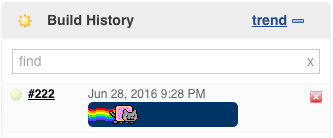
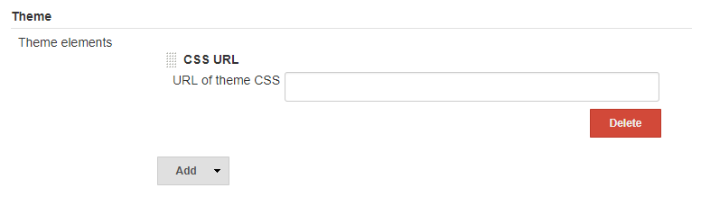

# Nyan Cat Jenkins

CSS for replacing cruddy Jenkins progress bars with sick
[Nyan Cat](http://nyan.cat) rainbow trails!

Forked from: https://github.com/yumoose/nyan-cat-jenkins 

But instead of Chrome extension its just a CSS file. 

## Screenshot

## Install 
On your Jenkins instance, go to Settings / Configure System, and simply add the URL of the CSS file, or CSS content  directly to Theme.

If using URL simply set it to:
https://raw.githubusercontent.com/mihailogazda/nyan-cat-jenkins/master/NyanCatJenkins.css

To add the star animations, simply add new JS URL:
https://cdn.jsdelivr.net/gh/mihailogazda/nyan-cat-jenkins@1c67cad5504ff17301c058eca96c2c9a2906cf98/NyanCatJenkins.js

## Features
* Animated rainbows and stuff!
* Starry, space blue background
* No extensions :)
